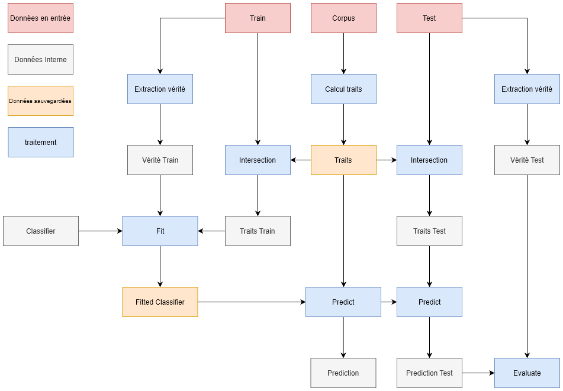

# Découverte de CVS

Classifieur ayant pour but de découvrire des couples (nom,verbe) pouvant former une CVS.

exemple :
* (prendre, décision) peut former une CVS
	* "Elle prend une décision" -> "prendre une décision" est une CVS
	* "La décision prend du temps" -> "décison prendre" n'est pas une CVS
* (jeter, éponge) ne peut former de CVS (car éponge n'est pas abstrait)

Comme le montre ce diagram :

Le classifier prend trois sources de données en entrée :
* Un corpus 'Corpus' au format .conllu

	Les mesures servant à la prédiction son calculé sur ce corpus,
	c'est aussi de ce corpus que les CVS prédite sont extraites.

	Pour modifier le répertoir source du corpus,
	ajouter l'argument `-corpus_dir [repertoire]` à l'execution du programme
* Un corpus 'Train' au format .cupt

	Les (nom,verbe) pouvant ou non former des CVS sont extrait de ce corpus
	et utilisé pour annoté un partie du des candidats générer a partir du 'Corpus'.

	Pour modifier le répertoir source du corpus,
	ajouter l'argument `-train_dir [repertoire]` à l'execution du programme

* Un corpus 'Test' au format .cupt

	Les (nom,verbe) pouvant ou non former des CVS sont extrait de ce corpus
	et utilisé pour annoté un partie du des candidats générer a partir du 'Corpus'

	Pour modifier le répertoir source du corpus,
	ajouter l'argument `-test_dir [repertoire]` à l'execution du programme

Le classifieur calcul des traits sur le 'Corpus' et les sauvegardes dans le répertoire 'Save',
une fois entrainé sur le 'Train' le classifieur se sauvegarde aussi dans ce même répertoire.
Les sauvegarde sont effectuer avec un hash du nom du répertoire ayant servie de source au calcul.
Ainsi, en appellant pour la première fois la fonction fit du classifieur une sauvegarde est faite.
En appelant une seconde fois, les résultats sont repris de la sauvegarde et non re-calculer.
Et, en appelant une autre fois, mais en changeant le répertoire 'Corpus' ou 'Train', la fonction est
éxecuté et le résultat enregistré.
* Pour changer le répertoire de sauvegarde, ajouter l'argument `-save_dir [repertoire]`.
* Pour forcer le classifieur à recalculer les traits, ajouter l'argument `-reset features`
* Pour forcer le classifier à se re-entrainer, ajouter l'argument `-reset classifier`
* Pour effacer toutes les sauvegardes, ajouter l'argument `reset full` (attention avec ça.)

Enfin, pour lancer le programme faire :

`python pred.py -predict` 

Cette commande entraine le classifieur (ou récupère un modèle sauvegardé préalablement)
et fait une prédiction.

`python pred.py -eval`

Cette commande entraine le classifieur (ou récupère un modèle sauvegardé préalablement)
et évalue les performance de ce dernier.

Exemple d'utilisation :

`python pred.py -reset classifier -eval -test_dir Dev`

Cette commande supprime l'ancien classifieur et évalue le nouveau classifieur 
grace au corpus dans le répertoire 'Dev'. 

Commande utile lors de la recherche d'hyperparamètre pour le classifieur.

`python pred.py -reset full -predict -corpus_dir ~/autre_corpus`

Cette commande supprime toutes précedente sauvegarde et effectue une prédiction sur le corpus
se trouvant dans le répertoire ~/autre_corpus. 

Commande utile pour découvrire des CVS sur un corpus ne pouvant être déplacé.

Pré-requis :

python3 avec :
* numpy  (`python -m pip install --upgrade numpy`)
* pandas (`python -m pip install --upgrade pandas`)
* scikit-learn (`python -m pip install --upgrade scikit-learn`)
* seaborn (`python -m pip install --upgrade seaborn`)
